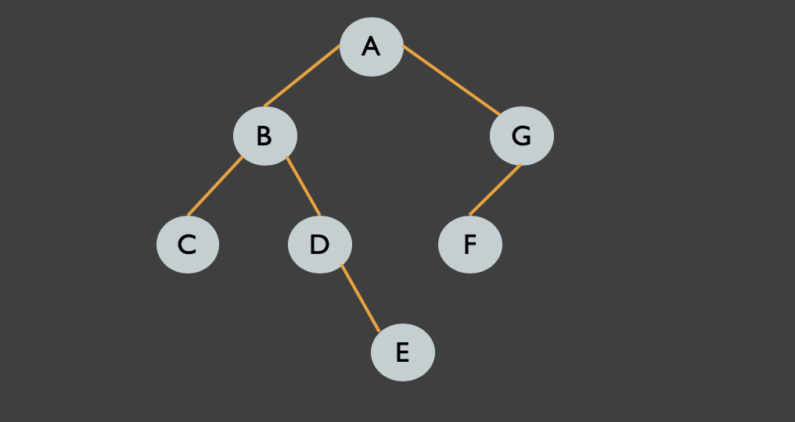

<h1 align="center">Data Structures</h1>
<h4>"Made by Scientific CSE PTUK"</h4>


- <a class="yt-simple-endpoint style-scope yt-formatted-string" spellcheck="false" href="/watch?v=owCqVRbZlbg&amp;list=PLCInYL3l2AajqOUW_2SwjWeMwf4vL4RSp" dir="auto"><b>Data Structures Full Course In Arabic</b></a>

- [Some summary](#Some_Summary)
- [Time Complexity](#TimeComlexity)
- [Array](#Array)
- [ArrayList](#ArrayList)
- [LinkedList](#LinkedList)
- [Stack](#Stack)
- [Queue](#Queue)
- [Recursion](#Recursion)
- [Binary Tree](#BinaryTree)
- [Binary Search Tree](#BinarySearchTree)
- [BFS](#BFS)
- [AVL Tree](#AVLTree)
- [Hash](#Hashing)
- [Sort](#sort)
- [Output](#Output)
- [some Questions](#Questions)

## Some_Summary

- <a href = "https://github.com/AbdullmenemFayez/Data-Structures/files/9434792/Big.O.Notation.pdf" target = "_blank">Big O Notation</a>

- <a href = "https://drive.google.com/drive/folders/1UZHAs9sN_H-9OFry-GuQdGjrcdXp2iP5" target ="_blank">Data Structures :3</a>

- <a href = "https://mega.nz/file/eeph3JrA#spfbxMtIAXJ_ssDA1MLximAX0rBgcoAipW1lmk_9YTc" target = "_blank">Data Structures Aseel</a>

- <a href = "https://mega.nz/file/KSpxDbCB#lLc0QhVnwZQD9dx99_TuQXUj1KhOKnf28P2Dd6vuf4w" target = "_blank">Data Structures Hadeel</a>

## TimeComlexity

<b>the time complexity is the computational complexity that describes the amount of computer time it takes to run an algorithm.</b>

In order to calculate time complexity on an algorithm, it is assumed that a constant time c is taken to execute one operation, and then the total operations for an input length on N are calculated.

- [Time Comlexity video](https://www.youtube.com/watch?v=sHhVsGQz9MI&list=PLCInYL3l2AajqOUW_2SwjWeMwf4vL4RSp&index=3)

```java
        class Example{
            void fun(int n){
                for (int i = 0; i < n; i++) {
                     System.out.println(n);

                }// Time O(n)


                for (int i = 0; i < n; i++) {
                    for (int j = 0; j < n; j++) {
                        System.out.println(n)
                    }
                }// O(n * n)


                for (int i = 0 ; i < n ; i++){
                    int j = n ;
                    while(j != 0){
                        j /= 2;
                    }

                }// O(n * log2(n))


                int i = 0 , j = 0;
                for( ; i < n ; i++){

                    while(j < n )++j;

                }// O(n) ? اللوب الداخلية فقط مرة وحدة تتم

                public int add100(int[] array) {
                    if (array.length < 100) {
                             return 0;
                    }
                    int sum = 0;
                    for (int i = 0; i < 100; i++) {
                               sum += array[i];
                    }
                    return sum;
                }// O(1)

            }
        }
```

<h4><a href = "https://mega.nz/folder/6D4HkKhJ#Oz-y1xtdmjNScm2rdUPiZg">more example </a></h4>
  
</br>


<figure class="table"><table><tbody><tr><td style="direction: ltr; text-align: left;"><strong>Input Length</strong></td><td style="direction: ltr; text-align: left;"><strong>Worst Accepted Time Complexity</strong></td><td><p align="center"><strong>Usually type of solutions</strong></p></td></tr><tr><td><p align="center">10 -12</p></td><td><p align="center">O(N!)</p></td><td><p align="center"><a href="https://www.geeksforgeeks.org/recursion/">Recursion</a> and <a href="https://www.geeksforgeeks.org/backtracking-algorithms/">backtracking</a></p></td></tr><tr><td><p align="center">15-18</p></td><td><p align="center"><font _mstmutation="1">O(2</font><sup>N </sup><font _mstmutation="1">* N)</font></p></td><td><p align="center">Recursion, backtracking, and<a href="https://www.geeksforgeeks.org/bits-manipulation-important-tactics/"> bit manipulation</a></p></td></tr><tr><td><p align="center">18-22</p></td><td><p align="center"><font _mstmutation="1">O(2</font><sup>N </sup><font _mstmutation="1">* N)</font></p></td><td><p align="center">Recursion, backtracking, and bit manipulation</p></td></tr><tr><td><p align="center">30-40</p></td><td style="direction: ltr; text-align: left;"><font _mstmutation="1">&nbsp; &nbsp; &nbsp; &nbsp; &nbsp; &nbsp; &nbsp; &nbsp; &nbsp; &nbsp; &nbsp; &nbsp;O(2</font><sup>N/2 </sup><font _mstmutation="1">* N)</font></td><td><p align="center"><a href="https://www.geeksforgeeks.org/meet-in-the-middle/">Meet in the middle</a>, <a href="https://www.geeksforgeeks.org/divide-and-conquer-introduction/">Divide and Conquer</a></p></td></tr><tr><td><p align="center">100</p></td><td><p align="center"><font _mstmutation="1">O(N</font><sup>4</sup>)</p></td><td><p align="center"><a href="https://www.geeksforgeeks.org/dynamic-programming/">Dynamic programming</a>, <a href="https://www.geeksforgeeks.org/basic/constructive-algorithms/">Constructive</a></p></td></tr><tr><td><p align="center">400</p></td><td><p align="center"><font _mstmutation="1">O(N</font><sup>3</sup>)</p></td><td><p align="center">Dynamic programming, Constructive</p></td></tr><tr><td><p align="center">2K</p></td><td><p align="center"><font _mstmutation="1">O(N</font><sup>2</sup><font _mstmutation="1">* log N)</font></p></td><td><p align="center">Dynamic programming, <a href="https://www.geeksforgeeks.org/binary-search/">Binary Search</a>,<a href="https://www.geeksforgeeks.org/sorting-algorithms/"> Sorting</a>,&nbsp;<br>Divide and Conquer</p></td></tr><tr><td><p align="center">10K</p></td><td><p align="center"><font _mstmutation="1">O(N</font><sup>2</sup>)</p></td><td><p align="center">Dynamic programming, <a href="https://www.geeksforgeeks.org/graph-data-structure-and-algorithms/">Graph</a>, <a href="https://www.geeksforgeeks.org/binary-tree-data-structure/">Trees</a>, Constructive</p></td></tr><tr><td><p align="center">1M</p></td><td><p align="center">O(N* log N)</p></td><td><p align="center">Sorting, Binary Search, Divide and Conquer</p></td></tr><tr><td><p align="center">100M</p></td><td><p align="center">O(N), O(log N), O(1)</p></td><td><p align="center">Constructive, <a href="https://www.geeksforgeeks.org/mathematical-algorithms/">Mathematical,</a> <a href="https://www.geeksforgeeks.org/greedy-algorithms-general-structure-and-applications/">Greedy Algorithms</a></p></td></tr></tbody></table></figure>

<h2>________________________________________________________</h2>

## Array

<b>An array is a collection of items stored at contiguous memory locations. Array is a container which can hold a fix number of items.</b>
</br>
<a href ="https://www.tutorialspoint.com/data_structures_algorithms/array_data_structure.htm" >for more</a>


<a href = "https://leetcode.com/problems/two-sum/"><b>Two Sum</b></a>

<a href ="https://leetcode.com/problems/contains-duplicate/"><b>Contains Duplicate</b></a>

<a href ="https://leetcode.com/problems/maximum-subarray/"><b> Maximum Subarray</b></a>
</br>

<h2>________________________________________________________</h2>

## ArrayList

<b>An ArrayList, or dynamically resizing array, allows you to have the benefits of an array while offering flexibility in size. You won’t run out of space in the ArrayList since it’s capacity will grow as you insert elements.</b>


<a href="https://github.com/AymanAttili/DataStructures/tree/master/src/com/DataStructures/Non_generic/ArrayList"><b>Here Implementation of ArrayList</a>
</br>
<a href = "https://github.com/AymanAttili/DataStructures/tree/master/src/com/DataStructures/Generic/ArrayList"><b>ArrayList Implementation Generic Data type</b></a>


</br>
<a href = "https://leetcode.com/problems/pascals-triangle/">Pascal's Triangle</a>

<h2>________________________________________________________</h2>

## LinkedList
<b>A linked list is a linear data structure, in which the elements are not stored at contiguous memory locations. The elements in a linked list are linked using pointers as shown in the below image:</b>


<h7><a href ="https://www.youtube.com/watch?v=R9PTBwOzceo"><b>Introduction to Linked List</b></a></h7>

<h7><a href ="https://leetcode.com/problems/design-linked-list/">Design Linked List</a></h7>


<h4><b>Linked List Vs Array</b></h4>


<a href ="https://github.com/AymanAttili/DataStructures/tree/master/src/com/DataStructures/Non_generic/LinkedLists">Here Implementation of Linked list</a>

<a herf ="https://github.com/AymanAttili/DataStructures/tree/master/src/com/DataStructures/Generic/LinkedLists">Linked List Implementation Generic Data type</a>

<h4>some Questions</h4>

* [Remove Linked List Elements](https://leetcode.com/problems/remove-linked-list-elements/)
* [Delete Node in a Linked List ._.](https://leetcode.com/problems/delete-node-in-a-linked-list/)
* [Linked List Cycle](https://leetcode.com/problems/linked-list-cycle/)
* [Reverse Linked List](https://leetcode.com/problems/reverse-linked-list/)

* [<h4>‘Quizzes’ on Linked List</h4>](https://www.geeksforgeeks.org/data-structure-gq/linked-list-gq/)

<h2>________________________________________________________</h2>

## Stack

<div>
<b>
 Stack is A collection based on the principle of adding 
elements and retrieving them in the opposite order.

Last-In, First-Out ("LIFO")

- Elements are stored in order of insertion.
- We do not think of them as having indexes.
- Client can only add/remove/examine 
the last element added (the "top").
</b></div>


<a href ="https://www.youtube.com/watch?v=9BZlgbZFR_c&list=PLCInYL3l2AajqOUW_2SwjWeMwf4vL4RSp&index=5">Introduction Stack Using Linked List</a>


<a href ="https://github.com/AymanAttili/DataStructures/tree/master/src/com/DataStructures/Non_generic/Stacks">Here Implementation of  Stack </a>

<a href ="https://github.com/AymanAttili/DataStructures/tree/master/src/com/DataStructures/Generic/Stacks">Stack Implementation Generic Data type</a>
<h4>some Questions</h4>

* [Implement stack using array](https://practice.geeksforgeeks.org/problems/implement-stack-using-array/1?page=1&category[]=Stack&sortBy=submissions)

* [Get minimum element from stack](https://practice.geeksforgeeks.org/problems/get-minimum-element-from-stack/1?page=1&category[]=Stack&sortBy=submissions)

<h2>________________________________________________________</h2>


## Queue 

<b> queue: Retrieves elements in the order they were added.</b>
* First-In, First-Out ("FIFO")
* Elements are stored in order of
insertion but don't have indexes.
*  Client can only add to the end of the
queue, and can only examine/remove
the front of the queue


<a href ="https://www.youtube.com/watch?v=8t_tzT52br8&t=389s">Queue Introduction(Simple Queue vs Circular Queue Using Array)</a>
<a href = "https://www.youtube.com/watch?v=VhRKjM759W8&list=PLCInYL3l2AajqOUW_2SwjWeMwf4vL4RSp&index=12"> Queue Using Linked List</a>


<a href ="https://github.com/AymanAttili/DataStructures/tree/master/src/com/DataStructures/Non_generic/Queues">Here Implementation of  Queue </a>

<a href ="https://github.com/AymanAttili/DataStructures/tree/master/src/com/DataStructures/Generic/Queues">Queue Implementation Generic Data type</a>

<h4>some Questions</h4>

* [Queue using two Stacks](https://practice.geeksforgeeks.org/problems/queue-using-two-stacks/1?page=1&category[]=Queue&sortBy=submissions)

* [Queue Reversal](https://practice.geeksforgeeks.org/problems/queue-reversal/1?page=1&category[]=Queue&sortBy=submissions)

* [‘Quizzes’ on Queue](https://www.geeksforgeeks.org/data-structure-gq/queue-gq/)
<h2>________________________________________________________</h2>

## Recursion

<b>

 recursion: The definition of an operation in terms of itself.
 * <u><h7>Solving a problem using recursion depends on solving
smaller occurrences of the same problem.<h7></u></b>

 recursive programming: Writing methods that call 
themselves to solve problems recursively

* An equally powerful substitute for iteration (loops)
* Particularly well-suited to solving certain types of problems like Tree 

when you need using Recursion you should know two things :

     1  -  Getting down one stair 

     2- Recognizing the bottom

* Most code will look like:

        if (simplest case){
            compute and return solution
        } else{
            divide into similar subproblem (s)
                    solve each subproblem recursively
            assemble the overall solution
        }

Evrey recursive algorithm involves at least 2 cases:

* base Case : A simple occurrence that can be answered 
directly.

* recursive case: A more complex occurrence of the problem 
that cannot be directly answered, but can instead be described 
in terms of smaller occurrences of the same problem.

* Some recursive algorithms have more than one base or 
recursive case, but all have at least one of each.
*  A crucial part of recursive programming is identifying these 
cases.

<a href ="https://recursion.vercel.app/?fbclid=IwAR3os4335zQsVRiqP5V2z0Z7511XomsW8rIsmIaO4n39kEZAR5Xuo6FOQao"><b><b>recursion Tree Visualizer</b></b> </a>
<h5>Recursion vs Iteration</h5>

```java
    public static void fun(int n) {
        while (n > 0) {

            System.out.print(n); // small piece of problem

            n--; // make the problem smaller
        }
        System.out.println(); // Base case n == 0
    }

    public static void fun(int n) {
        if (n == 0) {
            System.out.println(); // Base case n == 0
        } else {
            System.out.print(n); // small piece of problem

            fun(n - 1); // make the problem smaller
        }
    }    
```

</b>
<h2>________________________________________________________</h2>

## BinaryTree

* <b>Tree</b> :  Nodes linked together in some hierarchical fashion (Nonlinear data structure)

* <b>Binary Tree</b> : One where each node has at most two 
children.


        


* <h5>A tree is either:</h5> 

_ empty(null), or

_ A root node that contains :
         
         * data
         * A left subtree 
         * A right subtree
             _ The left and / or right subtrre could  be empty


Terminology : 

* node: an object containing a data value and left/right 
children
* root: topmost node of a tree
* leaf: a node that has no children
* branch: any internal node; neither the root nor a leaf
* parent: a node that refers to this one
* child: a node that this node refers to
* sibling: a node with a common parent
* subtree: the smaller tree of nodes on
the left or right of the current node
* height: length of the longest path
from the root to any node
* level or depth: length of the path
from a root to a given node


<h4>Types binary trees</h4>

* Full (Strictly)Binary tree 
,If every node has zero or two children .


        
* Complete Binary tree:

  A- All levels is completely filled except the last level.
        


  
  B- All Nodes as left as possible in last level


        
* Perfect Binary tree :
A. Every Nodes has two children

B. All leaves are at the same level


<h4>Class Tree Node :</h4>

``` java
class TreeNode{
    int val;
    TreeNode left,right;
    public TreeNode(){}
    public TreeNode(int val){this.val = val;}

    public TreeNode(int val, TreeNode left, TreeNode right) {
        this.val = val;
        this.left = left;
        this.right = right;
    }

}
```
 <h4>Print IntTree</h4>    

``` java
private void print(TreeNode root){
    if(root != null){
        System.out.print(root.val + " " );
        print(root.left);
        print(root.right);
    }
}
```   
<h5>Traversals :</h5>

* PreOrder : process root node, then its left/right subtrees.

* InOrder : process left subtree, then root node, then right.
* PostOrder : process left/right subtrees, then root node.
        


        
``` java
    private void preOrder(TreeNode root) {
        if (root != null) {
            System.out.print(root.val + " ");
            preOrder(root.left);
            preOrder(root.right);
        }
    }//output: 17 41 29 9 81 40

    private void inOrder(TreeNode root) {
        if (root != null) {
            inOrder(root.left);
            System.out.print(root.val + " ");
            inOrder(root.right);
        }
    }// output: 29 41 17 81 9 40

    private void postOrder(TreeNode root) {
        if (root != null) {
            postOrder(root.left);
            postOrder(root.right);
            System.out.print(root.val + " ");
        }
    }// 29 41 81 40 9 17


```
<b><a href = "https://www.youtube.com/watch?v=GzJoqJO1zdI">Binary Trees - Data Structures Explained</a></b>

<b><a href = "https://www.geeksforgeeks.org/data-structure-gq/binary-trees-gq/">‘Quizzes’ on Binary Trees</a></b>


   
        

<h4>Representing binary Tree Using Array: </h4>

* Left child = i * 2 + 1

* Right child = i * 2 + 2


<b>Array Binary Tree ==> [3,9,2,1,5,null,3,null,4,6,7,8,9,0,null,55]</b>

<h4>some Questions</h4>

* [Maximum Depth of Binary Tree](https://leetcode.com/problems/maximum-depth-of-binary-tree/)
* [Same Tree](https://leetcode.com/problems/same-tree/)
* [Balanced Binary Tree](https://leetcode.com/problems/balanced-binary-tree/) ==>  <h7>	<b> ( | Height(left subTree)- Height(Right SubTree)| < 2 )</b></h7>

 
<h2>________________________________________________________</h2>

## BinarySearchTree

binary search tree ("BST"): a binary tree where each 
non-empty node "N" has the following properties :

* The left subtree of a node contains only nodes with values lesser than the node’s values.
* The right subtree of a node contains only nodes with values greater than the node’s values.
* The left and right subtree each must also be a binary search tree.

</br>

<a href = "https://visualgo.net/en?fbclid=IwAR3dm0e8VtuEsOz-dbz_NPEOKII1HO5zcl8-Xya98AhB8ZD43ZLnP6AA8uQ"><b>VisuAlgov </b></a>

<a href = "https://www.youtube.com/watch?v=MikbKCPVsBY&list=PLCInYL3l2AajqOUW_2SwjWeMwf4vL4RSp&index=22" >Binary Search Tree(Insert-Delete-Search),Find:Successor-Predecessor-Max-Min</a>

<a href = "https://github.com/AymanAttili/DataStructures/tree/master/src/com/DataStructures/Trees">binary Search Implementation</a>

<h4>some Questions</h4>
<a href ="https://leetcode.com/problems/delete-node-in-a-bst/">Delete Node in a BST</a>

<a href="https://leetcode.com/problems/validate-binary-search-tree/">Validate Binary Search Tree</a>

<a href ="https://leetcode.com/problems/kth-smallest-element-in-a-bst/">Kth Smallest Element in a BST</a>


## BFS


<b>BFS: It's an algorithm used to traverse the elements of the Tree Level after level </b>

[](R.gif)

<h5> <a href ="https://github.com/AbdullmenemFayez/Data-Structures/blob/main/BFS.java">BFS Code</a> </h5>

<h7><b><a href ="https://leetcode.com/problems/binary-tree-zigzag-level-order-traversal/">Binary Tree Zigzag Level Order Traversal</a></b></h7>

<h2>________________________________________________________</h2>

## AVLTree

<h6>

* All BST  operations are O(d), where d is tree depth.
* Minimum d is <b>O(Log2(N))</b> , N == nodes count for any binary tree. 

so the best case is O(log n) and worst O(n)

* if you insert : 1 , 2 , 3 ,  4 , 5 , 6 to empty BTS you You will get an Lack of “balance” in the binary search Tree and become similar to LinkedList

[](00)
</h6>

<h5><b>Balancing Binary Search Trees : </b><h5>
* Adelson-Velskii and Landis <b>(AVL)</b> trees (height-balanced trees) 

<h4><a href ="https://www.youtube.com/watch?v=br-1squJfkA&list=PLCInYL3l2AajqOUW_2SwjWeMwf4vL4RSp&index=23&t=881s">AVL Tree</a></h4>

<a href ="https://ocw.mit.edu/courses/6-006-introduction-to-algorithms-fall-2011/resources/lecture-6-avl-trees-avl-sort/"><b>MIT Open Courseware</b></a>


<h4>some Questions</h4>

Given the following Integer elements:
6, 3, 2, 10, 8, 1, 11, 7, 5, 4, 9
Draw the tree that results when all of the above elements are added in
initially empty AVL tree .

 What is the balance factor of the root node of the AVL tree that you drew ? 
    

 Given the following AVL Tree:

[](02)

1-  Draw the resulting BST after 5 is removed, but before any rebalancing takes place. Label each node in the 
resulting tree with its balance factor. Replace a node with both children using an appropriate value from the 
node's left child.

2-  Now rebalance the tree that results from (a). Draw a new tree for each rotation that occurs when rebalancing the 
AVL Tree (you only need to draw one tree that results from an RL or LR rotation). You do not need to label 
these trees with balance factors. 


<h2>________________________________________________________</h2>

## Hashing

<b>Hashing</b> : is a technique or process of mapping keys, and values into the hash table by using a hash function. It is done for faster access to elements. The efficiency of mapping depends on the efficiency of the hash function used.


<h2>________________________________________________________</h2>

## Output

<h4><a href ="https://mega.nz/folder/reYz3QoY#iMibmi5CwXd1Z08uo12EOg">example<a></h4>
